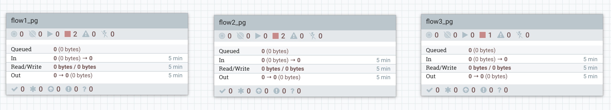
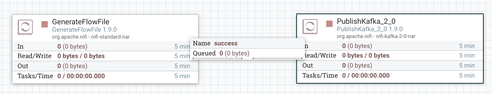
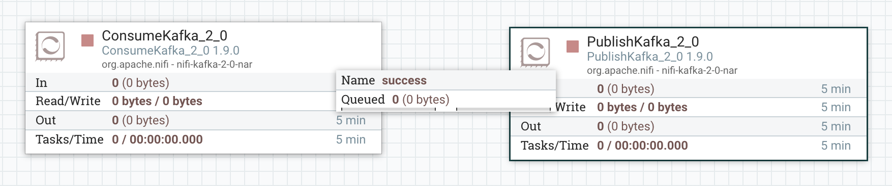
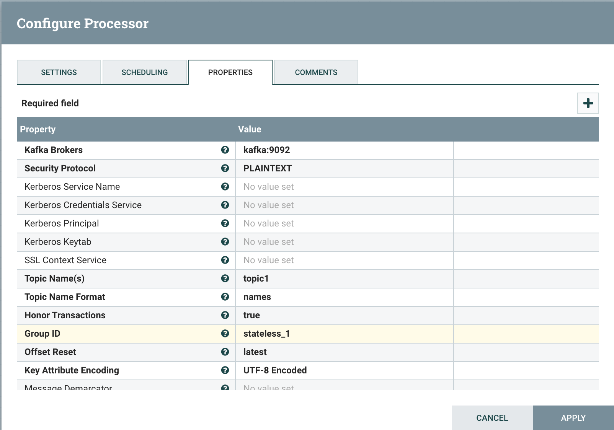
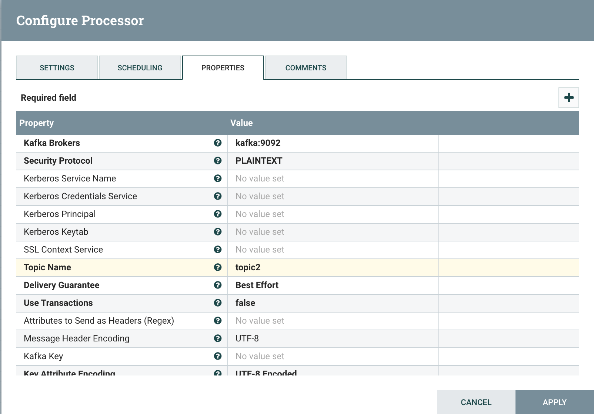
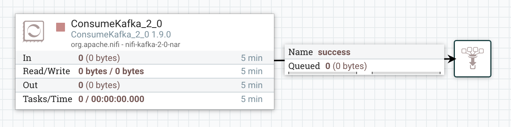
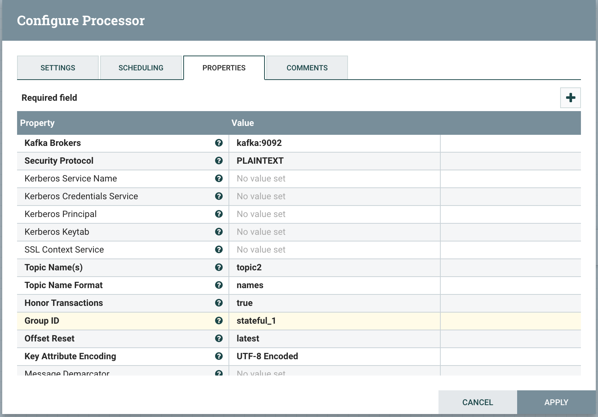

#Intro
This project shows how to set up NiFi environment with:
* NiFi
* NiFi Registry
* Kafka
* NiFi Stateless

Refer to:
https://github.com/apache/nifi/tree/master/nifi-nar-bundles/nifi-framework-bundle/nifi-framework/nifi-stateless

# Instructions
## Docker environment: Kafka and NiFi
These steps create the needed docker containers:
- Create the docker network:

    `docker network create --driver bridge nifi-net`
    
    All the containers will connect to this network
- Run the Zookeeper container (needed for Kafka):
    ```
  docker run \
      --name zookeeper \
      --hostname zookeeper \
      --network nifi-net \
      -p 2181:2181 \
      -d \
      wurstmeister/zookeeper:latest
  ```
  This container has hostname `zookeeper`

- Run the Kafka container:
    ```
    docker run \
       --name kafka \
       --hostname kafka \
       --network nifi-net \
       -p 9094:9094/tcp \
       -d \
       --env "KAFKA_ZOOKEEPER_CONNECT=zookeeper:2181" \
       --env "KAFKA_LISTENER_SECURITY_PROTOCOL_MAP=INSIDE:PLAINTEXT,OUTSIDE:PLAINTEXT" \
       --env "KAFKA_ADVERTISED_LISTENERS=INSIDE://:9092,OUTSIDE://kafka:9094" \
       --env "KAFKA_LISTENERS=INSIDE://:9092,OUTSIDE://:9094" \
       --env "KAFKA_INTER_BROKER_LISTENER_NAME=INSIDE" \
       --env "KAFKA_CREATE_TOPICS=test" \
       wurstmeister/kafka:latest
  ```
  This container has hostname `kafka`. When the container is started, a `topic` named test gets created.
  
  If you want to create more topics, specify a comma separated list of names.
  
  However, when a client tries to queue a message to a topic that does not exist, it is created (autocreate)

- Run the NiFi container:
  ```
  docker run \
    --name nifi \
    --hostname nifi \
    --network nifi-net \
    -p 8080:8080/tcp \
    -d \
    -e "NIFI_WEB_HTTP_HOST=0.0.0.0" \
    apache/nifi:latest
    ```
  This container has hostname `nifi`. You can connect to the NiFi UI at the link: `http://localhost:8080/nifi`
  
- Run the NiFi Registry container:
    ```
    docker run \
      --name nifi-registry \
      --hostname nifi-registry \
      -p 18080:18080 \
      -d \
      apache/nifi-registry:latest
  ```
  This container has hostname `nifi-registry`. You can connect to the NiFi Registry UI at the link: `http://localhost:18080/nifi-registry`

## Example flow
These instructions will guide you to create a simple flow using both stateful and stateless NiFi. Kafka is the message bus.

Here is the flow:
```
                 +------+                  +------+                   
         +------>|topic1|-----+        +-->|topic2|--------+          
         |       +------+     |        |   +------+        |          
         |                    V        |                   V          
+----------------+       +-----------------+      +----------------+  
|flow1 - stateful|       |flow2 - stateless|      |flow3 - stateful|  
+----------------+       +-----------------+      +----------------+ 
```
## Flow files
This section describes how to create the 3 flows. The root NiFi canvas will look like the following:


### flow1
This flow generates flow files and queues them to the Kafka topic `topic1`.
It will run in NiFi as a standard (aka stateful) flow.
Connect to NiFi and create the Process Group `flow1_pg`:


The PublishKafka_2_0 processor has the following properties:


All the relationships are terminated
### flow2
This flow consumes flow files from `topic1` and queues them to the topic `topic2`.
It will run in the stateless NiFi instance.
However, you need to create it in the main NiFi instance. It will then be loaded to NiFi Registry, from where the NiFi stateless instance will take it.
Connect to NiFi and create the Process Group `flow1_pg`:


The Kafka consumer is configured as follows:


The Kafka producer has all the relations terminated and is configured as follows:


### flow3
This is just a convenience flow to verify that `flow2` queues messages to the topic `topic2`.
Connect to NiFi and create the Process Group `flow3_pg`:


The Kafka consumer is configured as follows:

