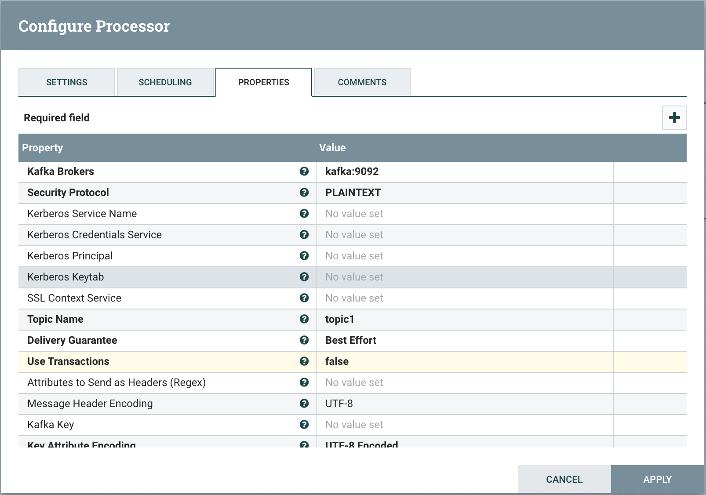
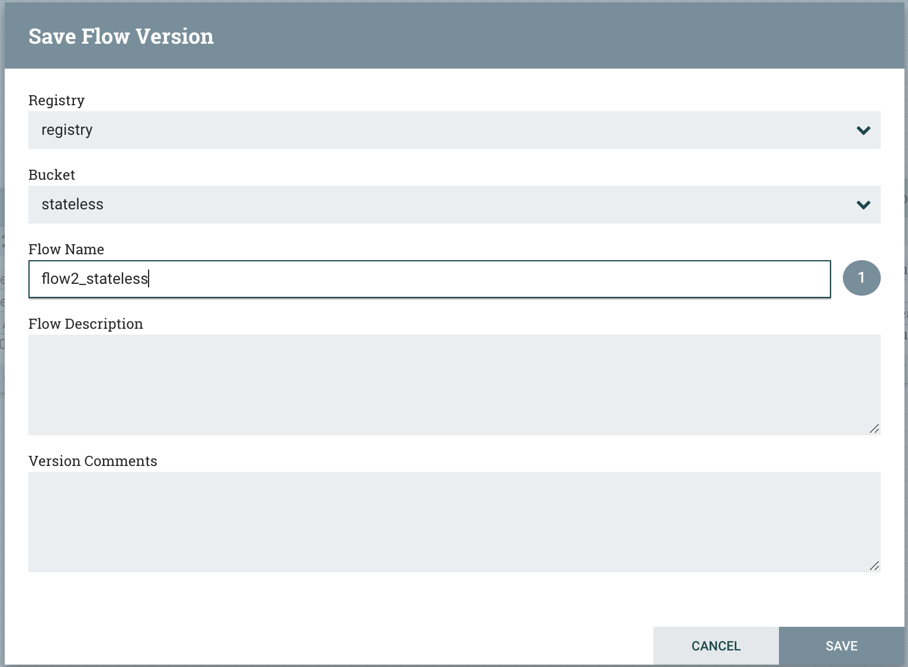
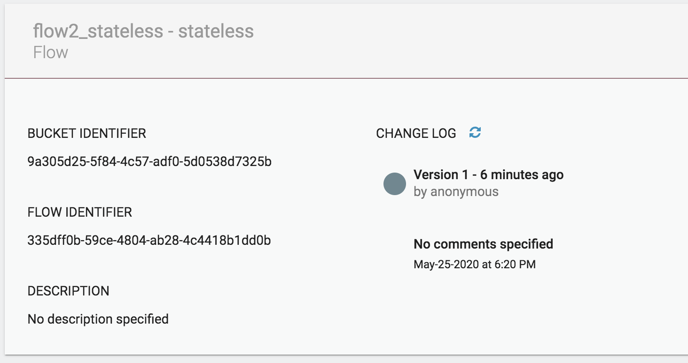
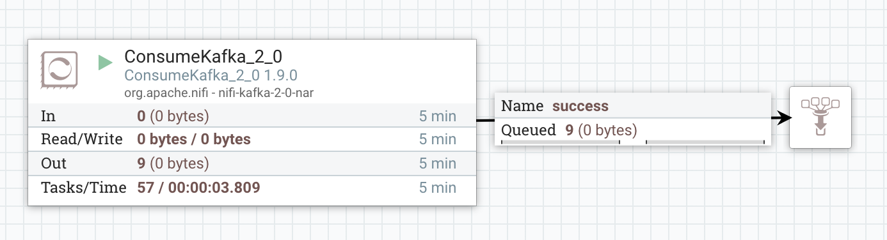

# Intro
This project shows how to set up NiFi environment with:
* NiFi
* NiFi Registry
* Kafka
* NiFi Stateless

Refer to:
https://github.com/apache/nifi/tree/master/nifi-nar-bundles/nifi-framework-bundle/nifi-framework/nifi-stateless

# Instructions
## Docker environment: Kafka and NiFi
These steps create the needed docker containers:
- Create the docker network:

    `docker network create --driver bridge nifi-net`
    
    All the containers will connect to the network `nifi-net`
- Run the Zookeeper container (needed for Kafka):
    ```
  docker run \
      --name zookeeper \
      --hostname zookeeper \
      --network nifi-net \
      -p 2181:2181 \
      -d \
      wurstmeister/zookeeper:latest
  ```
  This container has hostname `zookeeper`

- Run the Kafka container:
    ```
    docker run \
       --name kafka \
       --hostname kafka \
       --network nifi-net \
       -p 9094:9094/tcp \
       -d \
       --env "KAFKA_ZOOKEEPER_CONNECT=zookeeper:2181" \
       --env "KAFKA_LISTENER_SECURITY_PROTOCOL_MAP=INSIDE:PLAINTEXT,OUTSIDE:PLAINTEXT" \
       --env "KAFKA_ADVERTISED_LISTENERS=INSIDE://:9092,OUTSIDE://kafka:9094" \
       --env "KAFKA_LISTENERS=INSIDE://:9092,OUTSIDE://:9094" \
       --env "KAFKA_INTER_BROKER_LISTENER_NAME=INSIDE" \
       --env "KAFKA_CREATE_TOPICS=test" \
       wurstmeister/kafka:latest
  ```
  This container has hostname `kafka`. When the container is started, a topic named `test` gets created.
  
  If you want to create more topics, specify a comma separated list of names.
  
  However, when a client tries to queue a message to a topic that does not exist, it is created (autocreate)

- Run the NiFi container:
  ```
  docker run \
    --name nifi \
    --hostname nifi \
    --network nifi-net \
    -p 8080:8080/tcp \
    -d \
    -e "NIFI_WEB_HTTP_HOST=0.0.0.0" \
    apache/nifi:latest
    ```
  This container has hostname `nifi`. You can connect to the NiFi UI at the link: `http://localhost:8080/nifi`
  
- Run the NiFi Registry container:
    ```
    docker run \
      --name nifi-registry \
      --hostname nifi-registry \
      --network nifi-net \
      -p 18080:18080 \
      -d \
      apache/nifi-registry:latest
  ```
  This container has hostname `nifi-registry`. You can connect to the NiFi Registry UI at the link: `http://localhost:18080/nifi-registry`

## Example flow
These instructions will guide you to create a simple flow using both stateful and stateless NiFi. Kafka is the message bus.

Here is the flow:
```
                 +------+                  +------+                   
         +------>|topic1|-----+        +-->|topic2|--------+          
         |       +------+     |        |   +------+        |          
         |                    V        |                   V          
+----------------+       +-----------------+      +----------------+  
|flow1 - stateful|       |flow2 - stateless|      |flow3 - stateful|  
+----------------+       +-----------------+      +----------------+ 
```
## Flow files
This section describes how to create the 3 flows. The root NiFi canvas will look like the following:


### flow1
This flow generates flow files and queues them to the Kafka topic `topic1`.
It will run in NiFi as a standard (aka stateful) flow.
Connect to NiFi and create the Process Group `flow1_pg`:


Configure the GenerateFlowFile processor with the following values:
- Scheduling -> Run Schedule -> 5 sec

The PublishKafka_2_0 processor has the following properties:


All the relationships are terminated
### flow2
This flow consumes flow files from `topic1` and queues them to the topic `topic2`.
It will run in the stateless NiFi instance.
However, you need to create it in the main NiFi instance. It will then be loaded to NiFi Registry, from where the NiFi stateless instance will take it.
Connect to NiFi and create the Process Group `flow1_pg`:


The Kafka consumer is configured as follows:


The Kafka producer has all the relations terminated and is configured as follows:


### flow3
This is just a convenience flow to verify that `flow2` queues messages to the topic `topic2`.
Connect to NiFi and create the Process Group `flow3_pg`:


The Kafka consumer is configured as follows:


## NiFi stateless
A stateless NiFi instance executes a flow as a transactional microservice.
The flow is defined in the NiFi Registry and the stateless instance is configured to reference it.

### Load flow2 to NiFi Registry
- Connect NiFi to use the NiFi Registry instance as documented here:
    
    [Connect NiFi to the Registry](https://nifi.apache.org/docs/nifi-registry-docs/html/getting-started.html#connect-nifi-to-the-registry)

    Use `http://nifi-registry:18080` as the registry location.
- Connect to the NiFi Registry UI and create a bucket named `stateless` are described here:
    
    [Create a bucket](https://nifi.apache.org/docs/nifi-registry-docs/html/getting-started.html#create-a-bucket)
- Start the version control for `flow2`: right click on `flow2_pg` and `Version -> Start version control` and specify the following values:

- In the NiFi Registry UI, open the versioned flow and get the flow ID and the bucket ID:


- Create the file `flow.json` with the following content using the current values for the registry URL, bucketId and the flowId:
```
{
  "registryUrl": "http://nifi-registry:18080",
  "bucketId": "9a305d25-5f84-4c57-adf0-5d0538d7325b",
  "flowId": "335dff0b-59ce-4804-ab28-4c4418b1dd0b"
}
```

- Create the stateless NiFi container with the following command:
```
docker run \
   --name nifi-stateless \
   --hostname nifi-stateless \
   --network nifi-net \
   -d \
   apache/nifi-stateless:latest RunFromRegistry Continuous --json "$(cat ./flow.json)"
```

Now the stateless NiFi flow is active.

You can now access the NiFi UI and start:
- flow1_pg: to populate `topic1`
- flow3_pg: to verify that the stateless NiFi instance is actually consuming from the topic `topic1` and publishing to the topic `topic2`.

If it worked, you will see messages in the queue in the process group `flow3_pg`

9 messages in this picture.